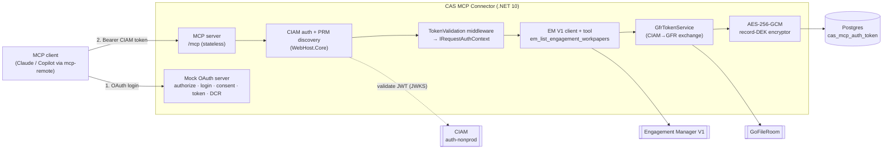
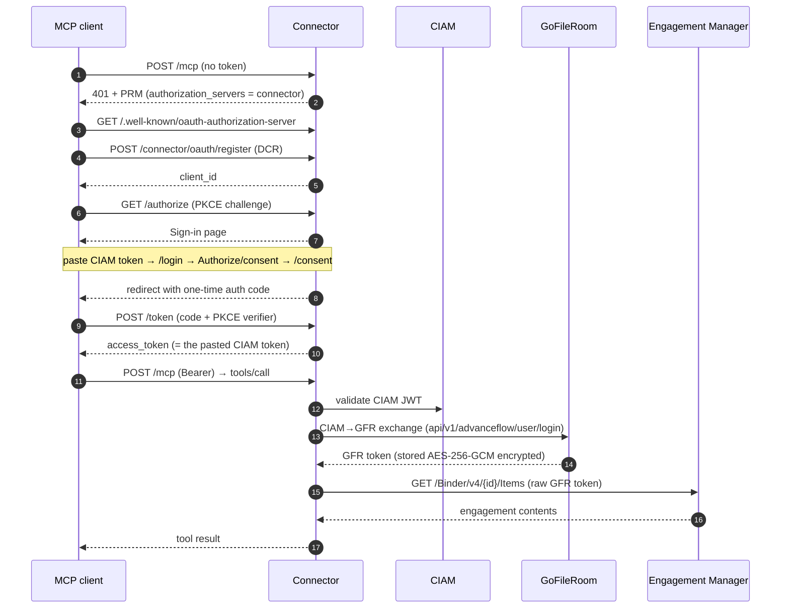

# Architecture

Standalone MCP connector that exposes CAS **Engagement Manager** tools to third-party AI clients
(Claude, Copilot, any MCP-compliant client). EM (GoFileRoom) only — **no GA**.

## Component overview

## Request flow (discovery → login → tool call)

## Building blocks
- **MCP server** — `ModelContextProtocol.AspNetCore`, stateless HTTP transport, `MapMcp("/mcp")`.
- **Auth (reused from CAS-MCP / WebHost.Core)** — `ConfigureCIAMAuthentication` validates the caller's
  CIAM JWT; `ConfigureMcpOAuthDiscovery` serves the protected-resource metadata (PRM). The PRM's
  `authorization_servers` is repointed to THIS connector per-request (`OnResourceMetadataRequest`).
- **Mock OAuth server** (`Auth/OAuth/`) — POC login/consent so no CIAM client registration is needed;
  the access token returned IS the pasted CIAM token.
- **GFR token exchange** (`GoFileRoom/`) — CIAM→GFR, persisted encrypted in Postgres, refreshed on 401.
- **Token store** (`DataAccess/`, `Security/`) — `cas_mcp_auth_token` (EM-only), AES-256-GCM record-DEK
  envelope encryption.
- **EM client + tool** (`EngagementManager/`, `Tools/`) — `em_list_engagement_workpapers` → EM V1
  `/Binder/v4/{id}/Items` with the resolved GFR token.

## Intentionally excluded
All Guided Assurance (GA/UDS): no GA pipeline, HTTP client, tools, refresh, or token columns.

## Not-for-production (spike shortcuts)
- Login is a **mock** (collects a CIAM token) — the real project uses a registered CIAM native client.
- In-memory auth-code store; single master key (no Key Vault rotation wired); no rate limiting.
